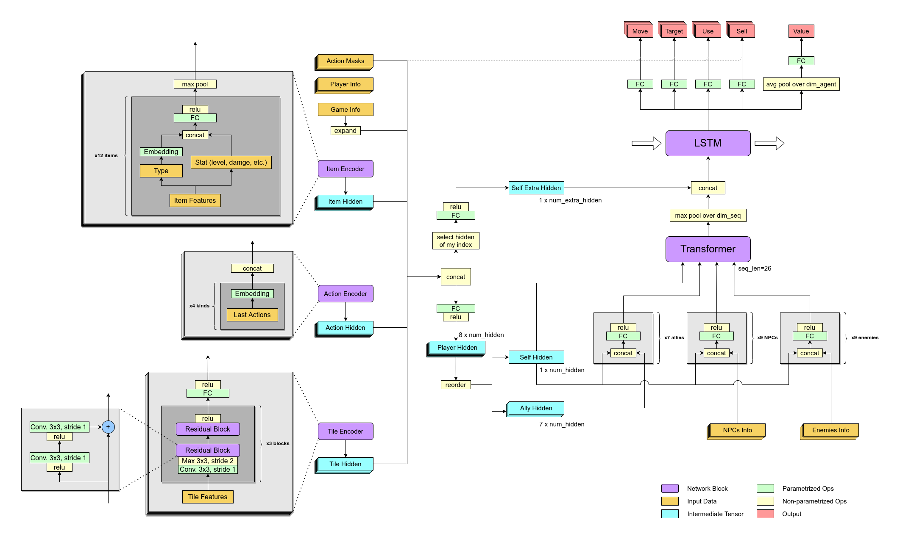

# [NeurIPS 2022] 1st Place Solution for the 3rd Neural MMO Challenge

This is the code of *realikun*'s submission for the Final PvP track. 

To learn more about the competition and the environment, please refer to [the competition homepage](https://www.aicrowd.com/challenges/neurips-2022-the-neural-mmo-challenge).

## Network Architecture

The transformer and LSTM locates in the core of the network, which compose most of the model’s total parameter count. Each of the eight players on the team is controlled by a replica of this network but with nearly totally different input of their own. The design is mainly borrowed from [*OpenAI Five*](https://arxiv.org/abs/1912.06680) and [*Hide and Seek*](https://arxiv.org/abs/1909.07528).

## Feature Design

Here shows the 7-channel inputs of Tile Encoder. we extend the original 15×15 view of agent to 25×25, the information in the extended areas come from both the historical view and something currently shared by its teammates. The first channel is the tile type, the type info is compressed into a single channel by dividing by 16, and we add an additional type representing the unexplored area. The second channel is the entity type, the different values are assigned for teammates, enemies and 3 kinds of NPCs. The third channel is the fog of war, which is a common concept used in RTS games, where a higher value indicates the tile has been recently explored. The fourth channel is the footprint, which explicitly encodes the historical moves of the agent. The last three channels are the poison intensity and coordinates of each tile.

